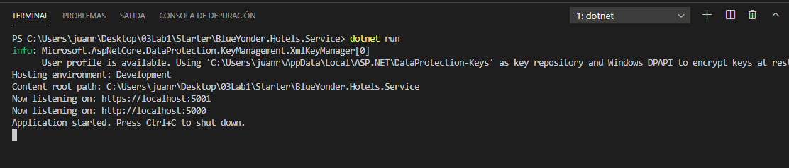
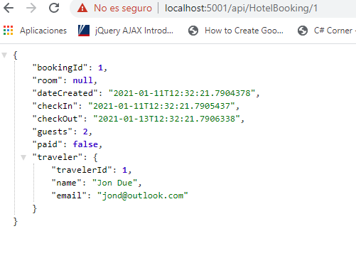
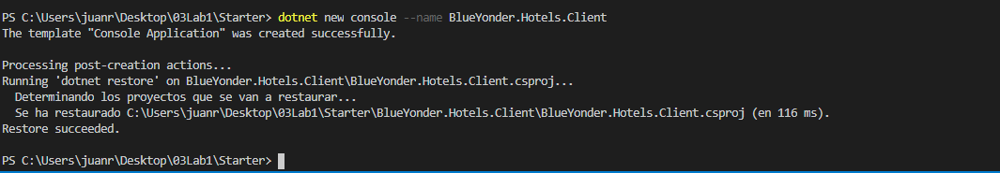
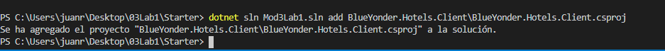
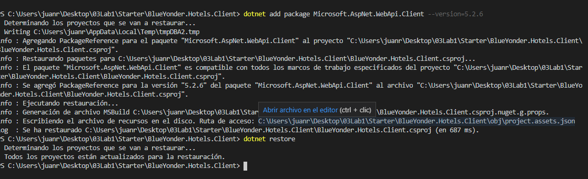
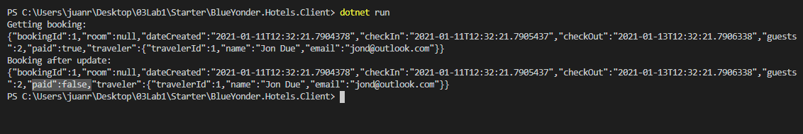

#### Lab: Creating an ASP.NET Core Web API

a partir de una capa de datos que accede a una base sql , creamos una api web con metodos GET/{id} POST y PUT 
y accedemos a ellos a traves de un cliente de consola  por medio de HttpClient


Examinamos primero la capa DAL 

[DAL\Database\MyDbContext.cs](DAL/Database/MyDbContext.cs)  
[DAL\Database\DbInitializer.cs](DAL/Database/DbInitializer.cs)  
[DAL\Repository\HotelBookingRepository.cs](DAL/Repository/HotelBookingRepository.cs)  


y el service  
[BlueYonder.Hotels.Service\Program.cs](BlueYonder.Hotels.Service/Program.cs)   
[BlueYonder.Hotels.Service\Startup.cs](BlueYonder.Hotels.Service/Startup.cs)   
 


desde la carpeta del proyecto ejecutamos dotnet restore


Abrimos Code y en el ptoyecto BlueYonder.Hotels.Service nos creamos el controlador [HotelBookingController](BlueYonder.Hotels.Service/Controllers/HotelBookingController.cs)

creamos refreencias a DAL.Repository.HotelBookingRepository

y creamos los métodos   
	Get api/HotelBooking/id  
	POST api/HotelBooking  
	PUT api/HotelBooking/id

hacemos un dotnet run




y la probamos en el navegador



Creamos un nuevo proyecto de consola



y loa ñadimos a la solucion con 
  
```bash
dotnet sln Mod3Lab1.sln add BlueYonder.Hotels.Client\BlueYonder.Hotels.Client.csproj
```




y finalmente le agregamos el paquete  Microsoft.AspNet.WebApi.Client --version=5.2.6

```bash
dotnet add package Microsoft.AspNet.WebApi.Client --version=5.2.6
dotnet restore
```




modificamos el archivo [BlueYonder.Hotels.Client.csproj](BlueYonder.Hotels.Client\BlueYonder.Hotels.Client.csproj)


```c#
<Project Sdk="Microsoft.NET.Sdk">

  <PropertyGroup>
    <OutputType>Exe</OutputType>
    <TargetFramework>net5.0</TargetFramework>
    <LangVersion>7.3</LangVersion>
  </PropertyGroup>

  <ItemGroup>
    <PackageReference Include="Microsoft.AspNet.WebApi.Client" Version="5.2.6" />
     <ProjectReference Include="..\DAL\DAL.csproj" />
  </ItemGroup>

</Project>
```


finalmente modificamos el archivo modificamos el archivo [BlueYonder.Hotels.Client/Main.cs](BlueYonder.Hotels.Client/Main.cs) para acceder a la api a traves de HttpClient

```c#
using System;
using DAL.Models;
using System.Net.Http;
using System.Threading.Tasks;

namespace BlueYonder.Hotels.Client
{
    class Program
    {
        static async Task Main(string[] args)
        {
          using (HttpClient client = new HttpClient())
            {
            HttpResponseMessage message = await client.GetAsync("http://localhost:5000/api/HotelBooking/1");
            Console.WriteLine("Getting booking:");
            string resultAsString = await message.Content.ReadAsStringAsync();
            Console.WriteLine(resultAsString);
            Booking booking = await message.Content.ReadAsAsync<Booking>();
            booking.Paid = false; 
            message = await client.PutAsJsonAsync("http://localhost:5000/api/HotelBooking/1", booking);
            resultAsString = await message.Content.ReadAsStringAsync();
            Console.WriteLine("Booking after update:");
            Console.WriteLine(resultAsString);
            }
        }
    }
}
```

Con la api funcionando ejecutamos el cliente 


en caso de tener errores por el certificado bastaría con
```c#
................
    class Program
    {
        static  async Task Main(string[] args)
        {

            HttpClientHandler clientHandler = new HttpClientHandler();
                clientHandler.ServerCertificateCustomValidationCallback =
                (sender, ClientCertificateOption, ContextMarshalException, sslPolicyErrors) => {return true; };

            using (var client = new HttpClient(clientHandler))
			{
			
			...................
}
```


voala!!  




