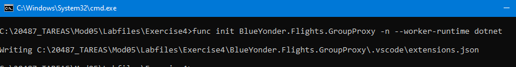
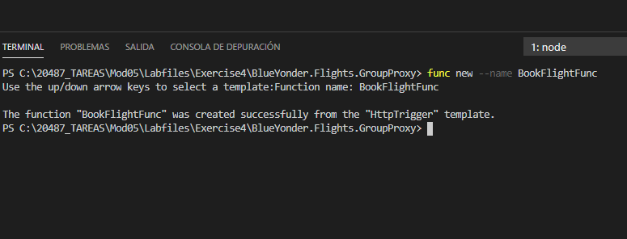
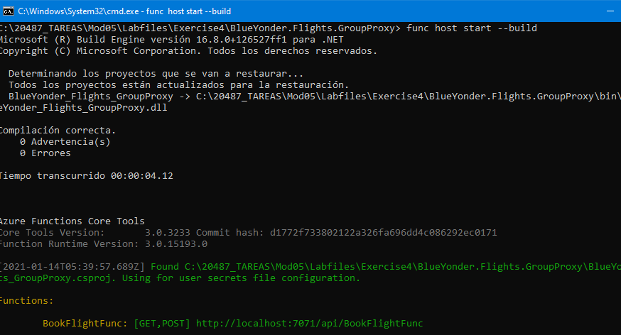
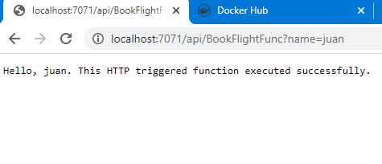

### Lab: Implement an Azure Function


```
Para este lab utilizamos Azure Functions Core Tools si no las tienes instaladas

npm i -g azure-functions-core-tools@core --unsafe-perm true
```

----

En este lab creamos una azure function en local con las Azure Tools.  

Modificamos el código de la función para que haga una llamada al Post del ejercccio 2

(añade viajeros al vuelo)

y la publicampos en Azure


----


Creamos un proyecto de funciones 

func init BlueYonder.Flights.GroupProxy -n --worker-runtime dotnet



Creamos la funcion con el trigger HttpTrigger



La probamos



nada nuevo




añadimos la clase Travellers.cs y modificamos la función con el código sigiente

nota debemos tener hecha el ejercicio 2 y funcionando https://blueyonder-flights-jrdf.azurewebsites.net/api/Flights

```c#
using System;
using System.IO;
using System.Threading.Tasks;
using Microsoft.AspNetCore.Mvc;
using Microsoft.Azure.WebJobs;
using Microsoft.Azure.WebJobs.Extensions.Http;
using Microsoft.AspNetCore.Http;
using Microsoft.Extensions.Logging;
using Newtonsoft.Json;
using System.Collections.Generic;
using System.Net.Http;
using System.Text;

namespace BlueYonder.Flights.GroupProxy
{
    public static class BookFlightFunc
    {
        [FunctionName("BookFlightFunc")]
        public static  IActionResult  Run(
            [HttpTrigger(AuthorizationLevel.Function, "get", "post", Route = null)] HttpRequest req,
            ILogger log)
        {
            log.LogInformation("C# HTTP trigger function processed a request to the flights booking service.");

            var flightId = req.Query["flightId"];

            var flightServiceUrl = $"http://blueyonder-flights-jrdf.azurewebsites.net/api/flights/bookFlight?flightId={flightId}";

            log.LogInformation($"Flights service url:{flightServiceUrl}");

            var travelers = new List<Traveler>
            {
                new Traveler { Email = "204837Dazure@gmail.com" , FirstName = "Jonathan", LastName = "James", MobilePhone = "+61 0658748", Passport = "204837DCBA" },
                new Traveler { Email = "204837Dfunction@gmail.com", FirstName = "James", LastName = "Barkal", MobilePhone = "+61 0658355", Passport = "204837DCBABC" }
            };

            var travelersAsJson = JsonConvert.SerializeObject(travelers);

            using (var client = new HttpClient())
            {
                client.PostAsync(flightServiceUrl,
                                 new StringContent(travelersAsJson,
                                                   Encoding.UTF8,
                                                   "application/json")).Wait();
            }

            return (ActionResult)new OkObjectResult($"Request to book flight was sent successfully");
        }
    }
}
```


la volvemos a ejectuar con func host start --build

Todo correcto


creamos una funcion app con la siguiente configuracion

)


publicamos (primero az login)


)


y probamos

)


