## AZ-204: DEVELOPING SOLUTIONS FOR MICROSOFT AZURE


### Lab: Creating a multi-tier solution by using services in Azure


#### Exercise 1: Creating an Azure App Service resource by using a Docker container image


----

Creamos los recursos
web app con una aplicacion docker 
api mannagent con la api creada
añadimos operaciones y polítcas

---- 


Task : Create a web app by using Azure App Service resource by using an httpbin container image

Basic Tab:
==========
Grupo de recursos: ApiService   
Nombre: httpapijrdf  
Publish: Docker  
So: Linix  
Location: la más cercana
ApPlan: ApiPlanjrdf  
Sku: por defecto

Docker Tab:
===========
Options: Single Container.  
Image Source: select Docker Hub.  
Access Type: Public.  
Image: kennethreitz/httpbin:latest 


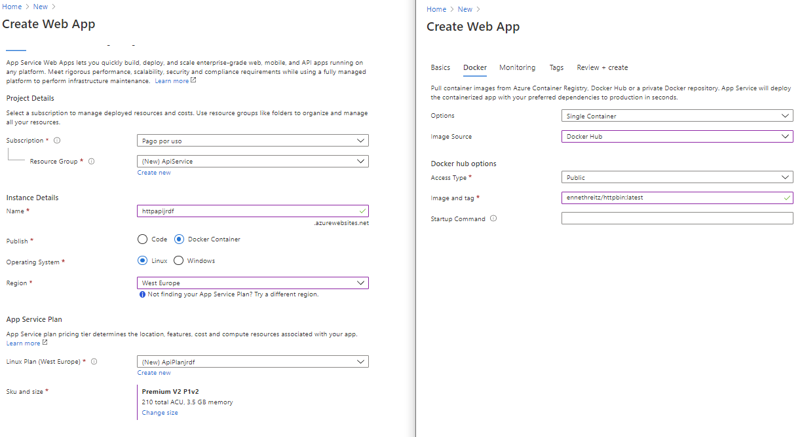


Task : Test the httpbin web application  Es simplemente hacer un Browse y probar el GET (si falla verificar [en ContainerSettings Image: Kennethreitz/httpbin:latest](imagenes/c4.PNG)   


Pero bueno no fallo ;·)

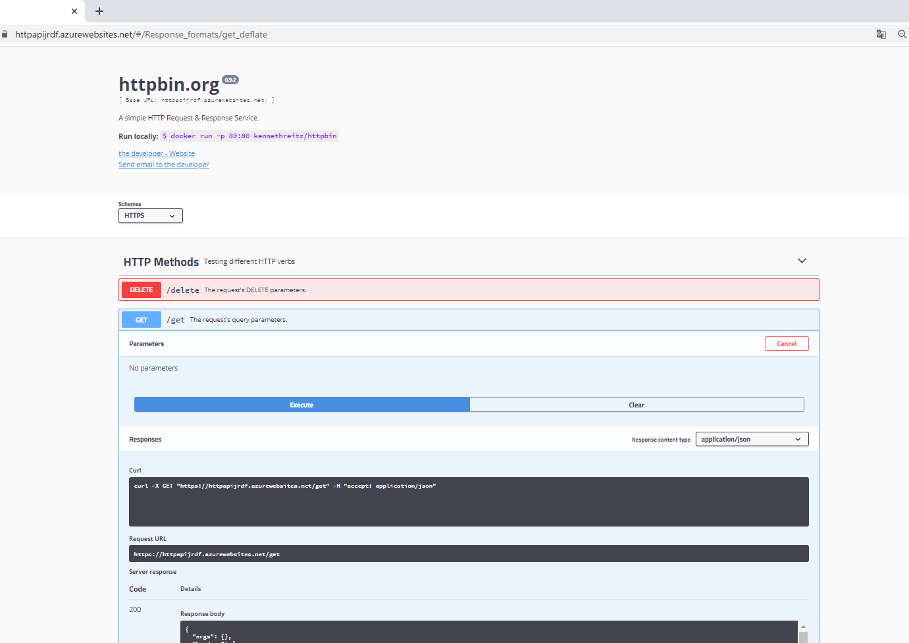

fijate en el valor de Request URL 


Finalmente copiate esa url porque la vamos a necesitar

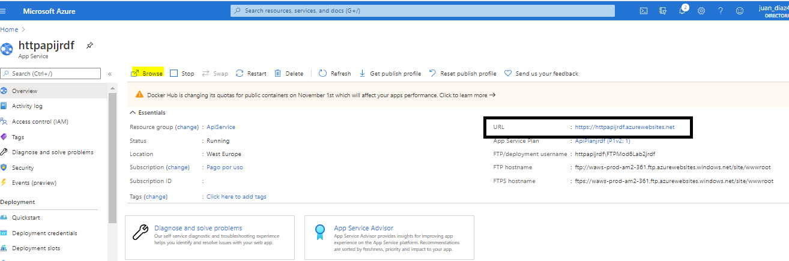


#### Exercise 2: Build an API proxy tier by using Azure API Management


Task: Create an API Management resource


Basic Tab:
==========
Grupo de recursos: ApiService   
Nombre: prodapikrdf  

Location: la más cercana

Organization name: la que más te guste
Administrator email: un mail válido si quieres
Pricing tier : Consumption (99.9 SLA, %)   !ESTO ES IMPORTANTE PARA QUE EL TIEMPO DE IMPLEMNTACION SEA CORTO!!! (si no tardará más de 40 ')


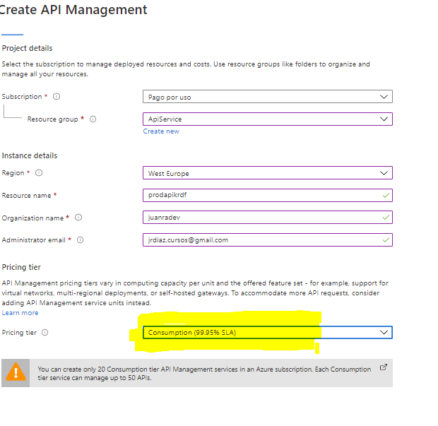

Vamos al recurso y añadimos una nueva API de tipo  __Blank API__

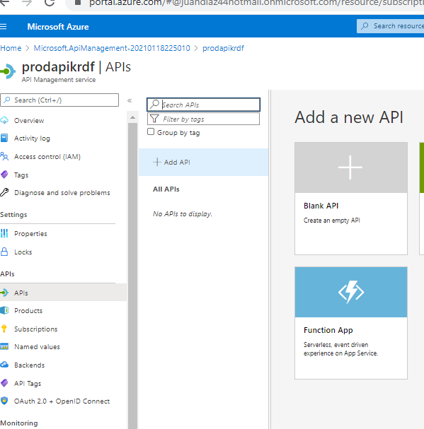


DisplayName: HTTPBin API  
name: httpbin-api  
Web service URL: la url que hemos copiado de httpapijrdf


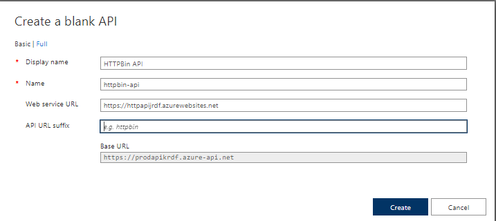


Vale ya está creada 

Añadimos Operación

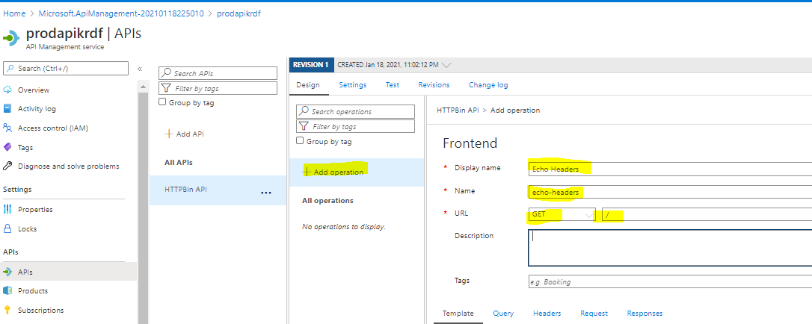


DisplayName: Echo Headers  
Name: echo headers  
URL GET   /

Añadimos Inbound processing

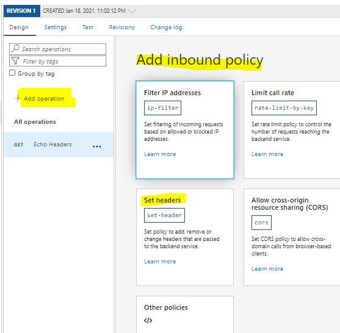


Name:source  
value: zure-api-mgmt  
action: append  

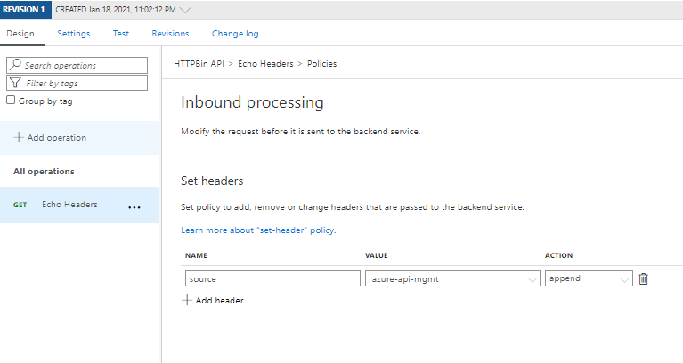


Editamos el Backend

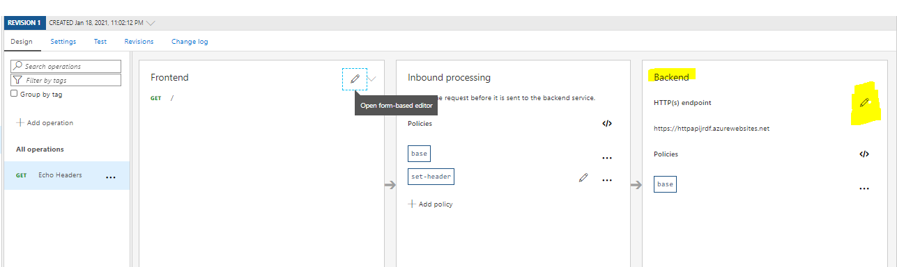


y sobreescrimios el service url añadiendo /headers

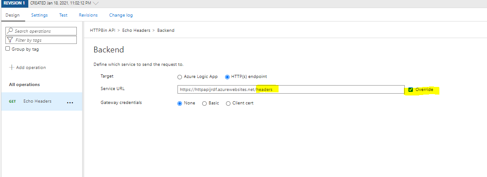


Task 3: Manipulate an API response

Añadimos otra nueva operación


DisplayName:Get Legacy Data   
Name: get-legacy-data   
URL GET   /xml  

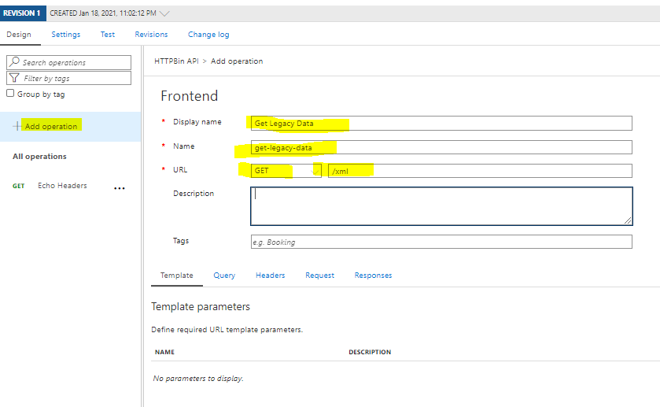


y le añadimos outbound policy Other policies 

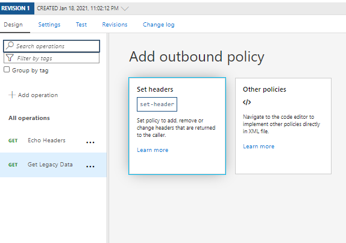


modificamos el xml

```xml
<policies>
    <inbound>
        <base />
    </inbound>
    <backend>
        <base />
    </backend>
    <outbound>
        <base />
        <xml-to-json kind="direct" apply="always" consider-accept-header="false" />
    </outbound>
    <on-error>
        <base />
    </on-error>
</policies>
```


Finalmente testeamos

[TEST](imagenes/c19.PNG)

[TEST](imagenes/c18.PNG)


Para rematar nos eliminaos el recurso desde Powershel

[TEST](imagenes/c20.PNG)
