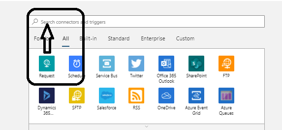
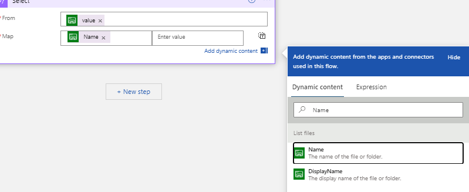
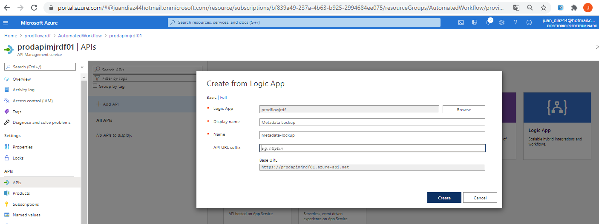

## AZ-204: DEVELOPING SOLUTIONS FOR MICROSOFT AZURE


### Lab: Creating a multi-tier solution by using services in Azure

---


[Intrucciones](https://microsoftlearning.github.io/AZ-204-DevelopingSolutionsforMicrosoftAzure/Instructions/Labs/AZ-204_09_lab_ak.html)

----


#### Exercise 1: Implement a workflow using Logic Apps

Task 2: Create an API Management resource

Name:  prodapimjrdf01  
Name: AutomatedWorkflow   
Pricing tier: __Consumption (99.9 SLA, %)__  


Task 3: Create a Logic App resource

Name:  prodflowjrdf   
Resource Group: AutomatedWorkflow    
Log Analytics: Off.  

Task 4: Create a storage account

Name: prodstorjrdf  
Performance: Standard.  
In the Replication list, select Locally-redundant storage (LRS).  
In the Access tier (default) section, ensure that Hot is selected.  


Task 5: Upload sample content to Azure Files

FileShared name: metadata
Cuota: 1 GB


----


#### Exercise 2: Implement a workflow using Logic Apps


Task 1: Create a trigger for the workflow

Abrimos el workflow:


seleccionamos el trigger HttpRequest





y le agregamos el metodo Get


Task 2: Create an action to query Azure Storage file shares


Nuevo Paso y seleccionamos 


Y le ponemos nuestra cuenta de almacenamiento y la carpeta


Task 3: Create an action to project list item properties


El siguiente paso es un Data Operations 


Task 4: Build an HTTP response action

Ojo que todo es por contenido dinamico





deberia quedar así


####  Exercise 3: Use Azure API Management as a proxy for Logic Apps

Task 1: Create an API integrated with Logic Apps


En el APi Mannagent añadimos una nueva API Logic APp




Task 2: Test the API operation


#### Exercise 4: Clean up your subscription


```

az group delete --name AutomatedWorkflow --no-wait --yes

```