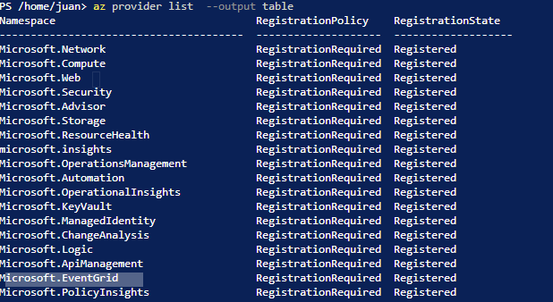
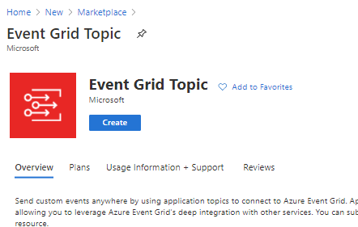

## AZ-204: DEVELOPING SOLUTIONS FOR MICROSOFT AZURE


### Lab: Publishing and subscribing to Event Grid events


[Instrucciones](https://microsoftlearning.github.io/AZ-204-DevelopingSolutionsforMicrosoftAzure/Instructions/Labs/AZ-204_10_lab_ak.html)


verificamos que tenemos activado Microsoft.EventGrid para nuestra subsripcion


ó con az provider list  --output table  




1.- Creamos un Event Grid topic



Name: hrtopicjrdf
Resource Group: PubSubEvents
Event Schema: Event Grid Schema


2.-  Deploy the Azure Event Grid viewer to a web app

Creamos un Web App

BASIC:  
Resource Group: PubSubEvents  
Name: eventviewerjrdf  
SO: LINUX  
PUBLISH: Docker Container  
PLAN: NEW(EventPlan)  
SKU y SIZE: por defecto  

Docker :
Options : Single Container
Image Source : Docker Hub.
Access Type :  Public.
Image:  microsoftlearning/azure-event-grid-viewer:latest


3.-- abrimos  eventviewerjrdf copiamos la url https://eventviewerjrdf.azurewebsites.net y lo probamos con BROWSE


(dejaremos esta web on)


https://hrtopicjrdf.francecentral-1.eventgrid.azure.net/api/events

4. Create Event Subscription en hrtopicjrdf


Name: basicsub  
Event Schema : Event Grid Schema  
Endpoint Type: Web Hook  
Subscriber Endpoint: pegamos la url del eventviewerjrdf más /api/updates : "https://eventviewerjrdf.azurewebsites.net/api/updates";


Observa que https://eventviewerjrdf.azurewebsites.net/ se a actualizado 


Exercise 3: Publish Event Grid events from .NET


Creamos un nuevo proyecto de consola net core app 3.1 y le añadimos Microsoft.Azure.EventGrid 3.2.0


```c#

dotnet new console --name EventPublisher --output . --framework netcoreapp3.1

dotnet add package Microsoft.Azure.EventGrid --version 3.2.0

dotnet build
```


Modificamos el programa


---

### Ojo hay que añadirle la clave del tpokey clave1 y el end point se sacan de estas dos pantallas 


---

```c#
using Microsoft.Azure.EventGrid;
using Microsoft.Azure.EventGrid.Models;
using System;
using System.Collections.Generic;
using System.Threading.Tasks;

namespace EventPublisher
{
    class Program
    {

        private const string topicEndpoint = "https://hrtopicjrdf.francecentral-1.eventgrid.azure.net/api/events";
        private const string topicKey = "uRkFjVmR5zm9JQlhV/AeyWfMKCS6nkqN9raC8fImcrk=";

        public static async Task Main(string[] args)
        {
            TopicCredentials credentials = new TopicCredentials(topicKey);
            EventGridClient client = new EventGridClient(credentials);

            List<EventGridEvent> events = new List<EventGridEvent>();

            var firstPerson = new
            {
                FullName = "Alba Sutton",
                Address = "4567 Pine Avenue, Edison, WA 97202"
            };

            EventGridEvent firstEvent = new EventGridEvent
            {
                Id = Guid.NewGuid().ToString(),
                EventType = "Employees.Registration.New",
                EventTime = DateTime.Now,
                Subject = $"New Employee: {firstPerson.FullName}",
                Data = firstPerson,
                DataVersion = "1.0.0"
            };
            events.Add(firstEvent);

            var secondPerson = new
            {
                FullName = "Alexandre Doyon",
                Address = "456 College Street, Bow, WA 98107"
            };

            EventGridEvent secondEvent = new EventGridEvent
            {
                Id = Guid.NewGuid().ToString(),
                EventType = "Employees.Registration.New",
                EventTime = DateTime.Now,
                Subject = $"New Employee: {secondPerson.FullName}",
                Data = secondPerson,
                DataVersion = "1.0.0"
            };
            events.Add(secondEvent);

            string topicHostname = new Uri(topicEndpoint).Host;
            await client.PublishEventsAsync(topicHostname, events);

            Console.WriteLine("Events published");
        }
    }
}
```

y ejecutamos 


