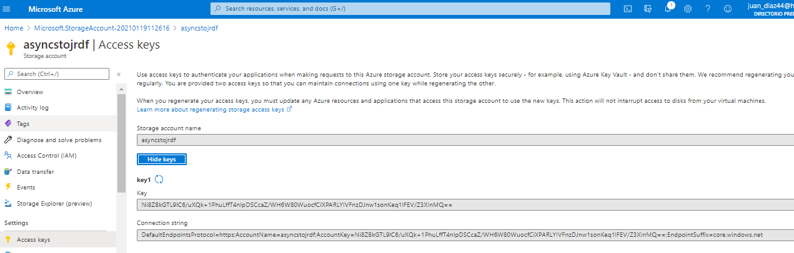

## AZ-204: DEVELOPING SOLUTIONS FOR MICROSOFT AZURE


### Lab : Asynchronously processing messages by using Azure Queue Storage


#### Exercise 1: Create Azure resources


Task 2: Create a Storage account


* Resource group: __AsyncProcessor__  
* Name: __asyncstorjrdf__  
* Performance: __Standard__  
* Account kind: __StorageV2 (general purpose v2).__    
* Replication:  __Locally-redundant storage (LRS).__
* Access tier : __Hot__


 
 
Copiamos la ConecctionString
 
###### ConecctionString=DefaultEndpointsProtocol=https;AccountName=asyncstojrdf;AccountKey=Ni8ZBkGTL9lC6/uXQk+1PhuLffT4nlpDSCcaZ/WH6W80WuocfCiXPARLYIVFnzDJnw1sonKeq1lFEV/Z3XInMQ==;EndpointSuffix=core.windows.net
 
 

#### Exercise 2: Configure the Azure Storage SDK in a .NET project
 
```

dotnet new console --name MessageProcessor --output . -f netcoreapp3.1

dotnet add package Azure.Storage.Queues --version 12.0.0

dotnet build
```

Modificar program.cs 
 
```c#
using System;
using System.Threading.Tasks;

using Azure;
using Azure.Storage.Queues;
using Azure.Storage.Queues.Models;

namespace MessageProcessor
{

    using Azure;
    using Azure.Storage.Queues;
    using Azure.Storage.Queues.Models;
    using System;
    using System.Threading.Tasks;

    public class Program
    {   
		// storage-connection-string ConnectionString from asyncstojrdf | Access keys

        private const string storageConnectionString = "DefaultEndpointsProtocol=https;AccountName=asyncstojrdf;AccountKey=Ni8ZBkGTL9lC6/uXQk+1PhuLffT4nlpDSCcaZ/WH6W80WuocfCiXPARLYIVFnzDJnw1sonKeq1lFEV/Z3XInMQ==;EndpointSuffix=core.windows.net";
        private const string queueName = "messagequeue";

        public static async Task Main(string[] args)
        {
            QueueClient client = new QueueClient(storageConnectionString, queueName);
            await client.CreateAsync();

            Console.WriteLine($"---Account Metadata---");
            Console.WriteLine($"Account Uri:\t{client.Uri}");
        }
    }

}
```


y ejecutamos para ver que la conexión funciona


#### Exercise 3: Add messages to the queue


Añadimos al Main

```c#
	...........................
	Console.WriteLine($"---Existing Messages---");
	int batchSize = 10;
	TimeSpan visibilityTimeout = TimeSpan.FromSeconds(2.5d);
	await  client.ReceiveMessagesAsync(batchSize, visibilityTimeout);
	Response<QueueMessage[]> messages = await client.ReceiveMessagesAsync(batchSize, visibilityTimeout);
	foreach(QueueMessage message in messages?.Value)
	{
		Console.WriteLine($"[{message.MessageId}]\t{message.MessageText}");
	}
```

y ejecutamos (vaya todavía ningún mensaje)  


Abrimos la Queue messagequeue  en el storage Account


y le añadimos un mensaje


y ejecutamos (y aparece el primer mensaje)  


Ahora modiciamos el Main para que elimine el mensaje leido

```
...
	Response<QueueMessage[]> messages = await client.ReceiveMessagesAsync(batchSize, visibilityTimeout);
	foreach(QueueMessage message in messages?.Value)
	{
		Console.WriteLine($"[{message.MessageId}]\t{message.MessageText}");


		// eliminación del mensaje leido
		await client.DeleteMessageAsync(message.MessageId, message.PopReceipt);
	}
```


#### Exercise 4: Queue new messages by using .NET

Añadamos mensajes desde net modifcamos nuevamente program.cs 

```
public static async Task Main(string[] args)
{
    \\ Existing code removed for brevity
        
    Console.WriteLine($"---New Messages---");
    string greeting = "Hi, Developer!";
    await client.SendMessageAsync(greeting);
        
    Console.WriteLine($"Sent Message:\t{greeting}");
}
````


Para finalizar eliminamos el grupo de registros 


```
az group delete --name AsyncProcessor --no-wait --yes
```
 
