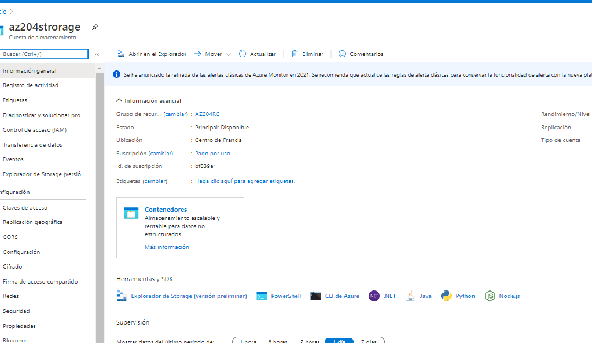

## AZ-204: DEVELOPING SOLUTIONS FOR MICROSOFT AZURE

### 05: CREATE AND DEPLOY ARM TEMPLATES

#### Demo: Create ARM templates by using the Azure Portal

----

1. Vamos a guardar una plantilla y sus parametros a partir de Azure

2. Vamos a cargar un fichero de plantilla y un fichero de parametros para crear el recurso

----

En Azure creamos una nueva plantilla de storage account

Para ello iniciamos la creación de una cuenta de almacenamiento damos a revisar y crear, pero en vez de pulsar a CREAR, presionamos 

Eso nos abre el editor de palantillas , revisa la pantalla,

 y presionamos a Download, nos desgarga un zip con dos json Template y Parameters.

Azure Portal se puede usar para realizar algunas ediciones básicas de plantillas mediante una herramienta de portal llamada Implementación de plantillas. Para editar una plantilla más compleja, considere utilizar Visual Studio Code, que proporciona funcionalidades de edición más completas.

Ahora vamos a hacer el proceso inverso tenemos un tempalte.json y un parameters.json,

Bien pues creamos una nueva Template desde Azure

vamos a crear su propia plantilla en el editor.

cargamos el archivo de templates 

y salvamos

una vez salvada tenemos la plantilla sin parametros, pues pues pulsamos editar parametros

y cargamos el archivo parameters.json

y guardamos

ya tenemos nuestra plantillda completa 

le metemos la subscripcion y el grupo de recursos damos y creamos 

y ya tenemos el recurso creado

Finalmente acuerate de eliminar los recursos si ya no los vas a utilizar

