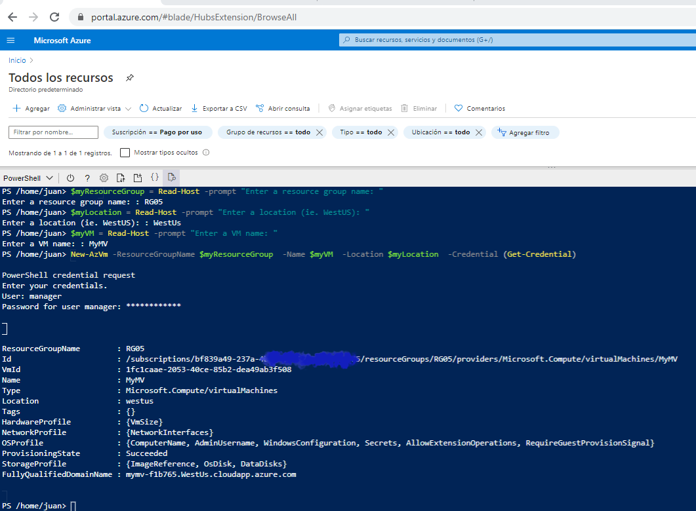

## AZ-204: DEVELOPING SOLUTIONS FOR MICROSOFT AZURE

### 05: CREATE AND DEPLOY ARM TEMPLATES

#### Demo: Creating an Azure VM by using PowerShell

----

utilizamos powershell para crear una maquina virtual

----
Abrimos un powershell ya sea desde pantalla o https://shell.azure.com

Abrimos el powershell


y ejecutamos 



```powershell
$myResourceGroup = Read-Host -prompt "Enter a resource group name: "
$myLocation = Read-Host -prompt "Enter a location (ie. WestUS): "
$myVM = Read-Host -prompt "Enter a VM name: "
$vmAdmin = Read-Host -prompt "Enter a VM admin user name: "

# The password must meet the length and complexity requirements.
$vmPassword = Read-Host -prompt "Enter the admin password: "

# create a resource group
New-AzResourceGroup -Name $myResourceGroup -Location $myLocation

# Create the virtual machine. 
 
New-AzVm -ResourceGroupName $myResourceGroup  -Name $myVM  -Location $myLocation  -Credential (Get-Credential)
````

