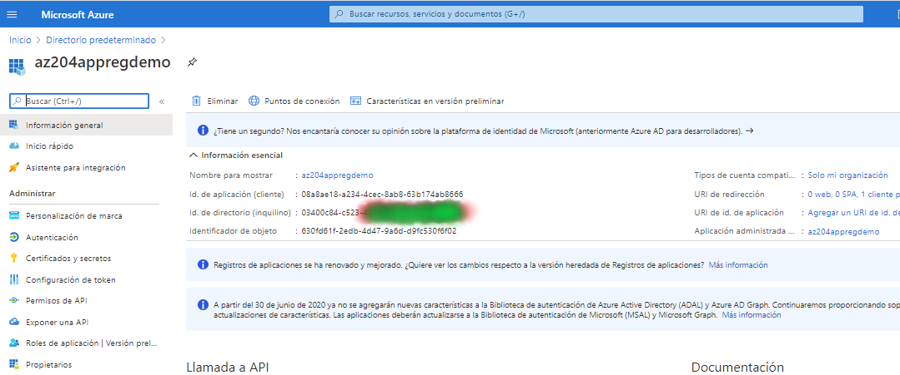
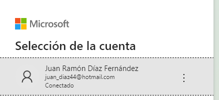
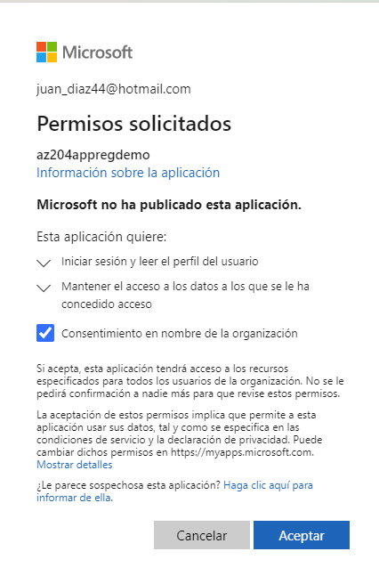
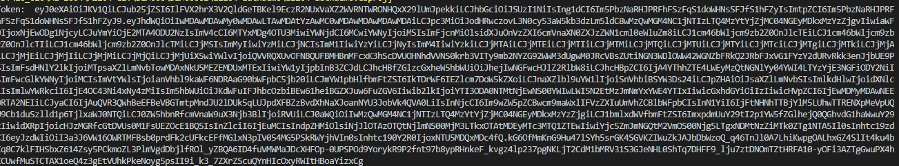

## AZ-204: DEVELOPING SOLUTIONS FOR MICROSOFT AZURE

### 06 Implement user application and authorization

#### Demo: Interactive authentication by using MSAL.NET

-----
Se trata de ver como se obtiene el token de authentication a través de MSAL.NET
-----

Creamos una aplicación de consola 
registramos 

Abrimos la app registrada en la demo anterior   
Agregamos PackageReference Include="Microsoft.Identity.Client" Version="4.24.0"   

Modificamos [az204-authdemo\Program.cs](az204-authdemo/Program.cs)  

En las constantes   _clientId  y  _tenantId les metemos los valores oportunos

y ejecutamos la aplicación 

nos pide logarnos

y obtenemos el token

