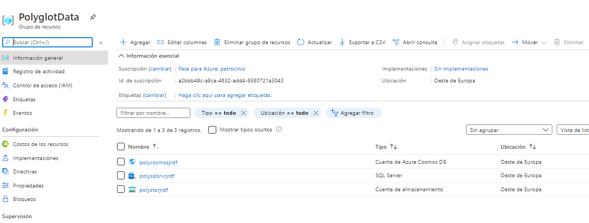

## AZ-204: DEVELOPING SOLUTIONS FOR MICROSOFT AZURE

### Lab: Constructing a polyglot data solution


---

__Azure__

1. Creacción de Grupo de Recursos
2. Creacción de sql server (ojo solo servidor) user tester pass TestPa55w.rd
   2.1 Asegurarnos permitir acceso público
3. Creacción de Cuenta de Azure Cosmos DB
4. Creacción de Strorage Account  
    4.1. Creacción de contenedor imagenes  (acceso público )
    4.2. Creación de contenedor database (acceso privado)
	
5. Pasos posteriores   
 	5.1. cargar ficheros en imagenes  
	5.2. cargar fichero AdventureWorks.bacpac en database 	
	5.3. agregar IP a Firwall del SQL server  y permitir que los servicios de Azure accedan al servidor
	5.4. crear base de datos a partir del container en el server de SQL server   (esto tarda paciencia)


	
6. Tener a mano las claves y cadenas de conexión que vamos a necesitar  
	6.1. url container imagenes
	6.2. claves de acceso de la cuenta de COSMOS DB
	6.3  cadena de conexion de la base de datos AdventureWorks 
	
7. Programación:  A partir de aqui seguir a patrir del Exercise 3: Open and configure a .NET web application de las [Instrucciones ](https://microsoftlearning.github.io/AZ-204-DevelopingSolutionsforMicrosoftAzure/Instructions/Labs/AZ-204_04_lab_ak.html)

---

	
Comandos de azure (1-4) nota: puede que haya que cambiar algún datos como subscription, etc..

```
# login
az login

## Creacción de Grupo de Recursos
az group create --location westeurope --name PolyglotData --subscription "Pase para Azure: patrocinio"

## Creacción de sql server 
az sql server create --admin-password TestPa55w.rd --admin-user testuser --name polysqlsrvrjrdf --resource-group PolyglotData --enable-public-network true --location westeurope --subscription "Pase para Azure: patrocinio"
az sql server update -n polysqlsrvrjrdf -g PolyglotData --set publicNetworkAccess="Enabled" --subscription "Pase para Azure: patrocinio"

## Creacción de la Cuenta de Azure Cosmos DB
az cosmosdb create --name polycosmosjrdf --resource-group PolyglotData --locations regionName=westeurope failoverPriority=0 isZoneRedundant=False  --subscription "Pase para Azure: patrocinio" --default-consistency-level Eventual

## Creacción de la cuenta de almacenamiento
az storage account create --name polystorjrdf --resource-group PolyglotData --location westeurope --subscription "Pase para Azure: patrocinio" --kind StorageV2 --access-tier Hot --sku Standard_LRS

## Creacción de la cuenta de contenedores
az storage container create -n images --public-access blob --account-name polystorjrdf --resource-group PolyglotData --subscription "Pase para Azure: patrocinio"
az storage container create -n databases --public-access off --account-name polystorjrdf --resource-group PolyglotData --subscription "Pase para Azure: patrocinio"
	

```
	



Pasos posteriores  :  

5.1 cargar ficheros en imagenes  


5.2 cargar fichero AdventureWorks.bacpac en database  


5.3 agregar IP a Firwall del SQL server  y permitir que los servicios de Azure accedan al servidor


5.4 crear base de datos a partir del container database en el SQL server 


 (lleva tiempo se paciente)
 
 

	
Tener a mano las claves y cadenas de conexión que vamos a necesitar: (abrimos un bloq de notas y las vamos pegando)  


6.1. url container imagenes


6.2. claves de acceso de la cuenta de COSMOS DB: CADENA DE CONEXIÓN PRINCIPAL  


6.3. cadena de conexion de la base de datos AdventureWorks (una vez copiada ponerle la password para tenerla lista)
	


lo guardamos en un archivito de texto para tenerlo a mano


7. Contiuamos con el marckdown en el punto indicado


Abrimos la carpeta LAB04\Starter\AdventureWorks con Code dejamos restaurar y nacemos un dotnet build para ver que todo este OK

Ojo como esta en netcoreapp3.0 nos van a aparecer warning de depercated que no le vamos a hacer caso


Vamos al tema:

Lo primero en [AdventureWorks.Web\appsettings.json](Starter/AdventureWorks//AdventureWorks.Web/appsettings.json) les metemos las diferentes cadenas de conexión (acuerdate de haber modificado la pass de la de SQL)

nos dice hacer un dotnet build cada vez que modificamos algo para ver que esta correcto.


Vamos a crear un proyecto dotnet new console --name AdventureWorks.Migrate -f netcoreapp3.0

Es posible que de un error si no tenemos instalada la plantilla correspondiente, si es asi leemos el mensaje ejecutamos el comando qie nos dicen y volvemos a intentar crear el projecto


Añadimos las dos referencias que necesitamos

dotnet add .\AdventureWorks.Migrate\AdventureWorks.Migrate.csproj reference .\AdventureWorks.Models\AdventureWorks.Models.csproj
dotnet add .\AdventureWorks.Migrate\AdventureWorks.Migrate.csproj reference .\AdventureWorks.Context\AdventureWorks.Context.csproj


Añadimos el EF y el COSMOS que necistamos

cd .\AdventureWorks.Migrate\
dotnet add package Microsoft.EntityFrameworkCore.SqlServer --version 3.0.1
dotnet add package Microsoft.Azure.Cosmos --version 3.4.1


y hacemos un dotnet build para ver que todo Ok


creamos [AdventureWorks.Context\AdventureWorksCosmosContext.cs](Starter/AdventureWorks/AdventureWorks.Context/AdventureWorksCosmosContext.cs)

Este Program lo que hace es abrir la base de datos de sql server t sacar en una List<Model> y en un campo un array con los productos de ese modelo
(SELECT *FROM [Models] left join Products on Models.id = Products.Modelid pero con un cursor)


```
            using AdventureWorksSqlContext context = new AdventureWorksSqlContext(sqlDBConnectionString);

            await Console.Out.WriteLineAsync("Start Migration");
            List<Model> items = await context.Models
                        .Include(m => m.Products)
                        .ToListAsync<Model>();
            await Console.Out.WriteLineAsync($"Total Azure SQL DB Records: {items.Count}");
```

y la parte de Cosmos 
crea la base Retail si no existe (que no existe porque solo creamos la cuenta cosmosDB)  
crea el contnedor (documento) Online con un Model.Category) Model.Category  
recorre la lista de elementos que hemos traido y los inserta uno a uno  

```
            using CosmosClient client = new CosmosClient(cosmosDBConnectionString);
            Database database = await client.CreateDatabaseIfNotExistsAsync("Retail");
            Container container = await database.CreateContainerIfNotExistsAsync("Online",
                            partitionKeyPath: $"/{nameof(Model.Category)}",
                            throughput: 1000
                        );
            int count = 0;
            foreach (var item in items)
            {
                ItemResponse<Model> document = await container.UpsertItemAsync<Model>(item);
                await Console.Out.WriteLineAsync($"Upserted document #{++count:000} [Activity Id: {document.ActivityId}]");
            }
            await Console.Out.WriteLineAsync($"Total Azure Cosmos DB Documents: {count}");
```

ejecutamos con dotnet run

Parece que ok


y en Cosmos?. Pues nada abrimos nos vamos a explorar los datos y hay los tenemos.


#### Exercise 5: Accessing Azure Cosmos DB by using .NET


Agregamos Azure.Cosmos --version 3.4.1 a AdventureWorks.Contex

cd .\AdventureWorks.Context\
dotnet add package Microsoft.Azure.Cosmos --version 3.4.1


Nos creamos el archivos [AdventureWorks.Context/AdventureWorksCosmosContext.cs](Starter/AdventureWorks/AdventureWorks.Context/AdventureWorksCosmosContext.cs)


En el controlador abre la base Retail documento Online que vimos que migrate creo

y despues implementa la interfaz IAdventureWorksProductContext

```c#
using AdventureWorks.Models;
using Microsoft.Azure.Cosmos;
using Microsoft.Azure.Cosmos.Linq;
using System;
using System.Collections.Generic;
using System.Linq;
using System.Threading.Tasks;

namespace AdventureWorks.Context
{
  public class AdventureWorksCosmosContext : IAdventureWorksProductContext
    {
        private readonly Container _container;

        public AdventureWorksCosmosContext(string connectionString, string database = "Retail", string container = "Online")
        {
            _container = new CosmosClient(connectionString)
                .GetDatabase(database)
                .GetContainer(container);
        }
        public async Task<Model> FindModelAsync(Guid id)
        {
            var iterator = _container.GetItemLinqQueryable<Model>()
                .Where(m => m.id == id)
                .ToFeedIterator<Model>();

            List<Model> matches = new List<Model>();
            while (iterator.HasMoreResults)
            {
                var next = await iterator.ReadNextAsync();
                matches.AddRange(next);
            }

            return matches.SingleOrDefault();
        }

        public async Task<List<Model>> GetModelsAsync()
        {
            string query = $@"SELECT * FROM items";

            var iterator = _container.GetItemQueryIterator<Model>(query);

            List<Model> matches = new List<Model>();
            while (iterator.HasMoreResults)
            {
                var next = await iterator.ReadNextAsync();
                matches.AddRange(next);
            }

            return matches;
        }

        public async Task<Product> FindProductAsync(Guid id)
        {
            string query = $@"SELECT VALUE products
                                FROM models
                                JOIN products in models.Products
                                WHERE products.id = '{id}'";

            var iterator = _container.GetItemQueryIterator<Product>(query);

            List<Product> matches = new List<Product>();
            while (iterator.HasMoreResults)
            {
                var next = await iterator.ReadNextAsync();
                matches.AddRange(next);
            }

            return matches.SingleOrDefault();
        }
    }
}
```

hacemos dotnet build de  AdventureWorks.Context porque vamos a modificar AdventureWorks.Web que va a utilizar esta clase AdventureWorksCosmosContext

(nota: despues he tenido que cerrar code y volver a abrirlo porque no me encontraba en el web esta referencia a AdventureWorksCosmosContext)

Bueno pues nos toca moficar [AdventureWorks.Web\Startup.cs](Starter/AdventureWorks/AdventureWorks.Web/Startup.cs)

Este cambio es sencillo basta con modificar  ConfigureProductService para que cargue AdventureWorksCosmosContext

```c#
		/* public void ConfigureProductService(IServiceCollection services)
				{            
					services.AddScoped<IAdventureWorksProductContext, AdventureWorksSqlContext>(provider =>
						new AdventureWorksSqlContext(
							_configuration.GetConnectionString(nameof(AdventureWorksSqlContext))
						)
					);
				}
		*/

        public void ConfigureProductService(IServiceCollection services)
        {
            
            services.AddScoped<IAdventureWorksProductContext, AdventureWorksCosmosContext>(provider =>
            new AdventureWorksCosmosContext(
                _configuration.GetConnectionString(nameof(AdventureWorksCosmosContext))
            )
        );
        }
```

verifica las cadenas de conexion en [AdventureWorks.Web\appsettings.json](Starter/AdventureWorks/AdventureWorks.Web/appsettings.json)


y ejecutamos AdventureWorks.Web (nos indican que ADDchart está disabled, será para un próximo lab)


Resumiendo

el Migrate lo que hace es pasar los datos del sql server al cosmos db sql  
hemos modificado el programa para que pase de tirar del sql server lo haga al cosmos  


finalmente eliminamos todo del azure  


az group delete --name PolyglotData --no-wait --yes --subscription "Pase para Azure: patrocinio"