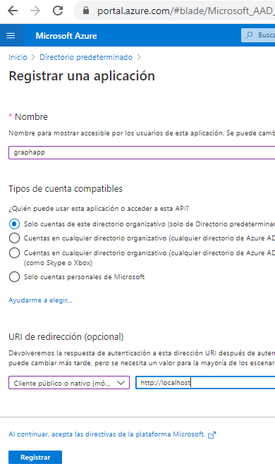
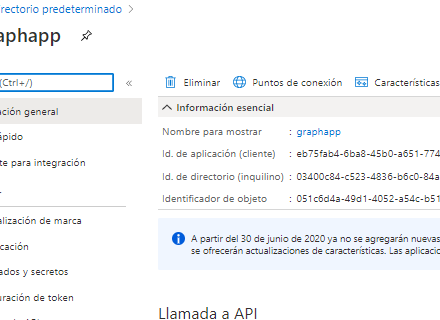
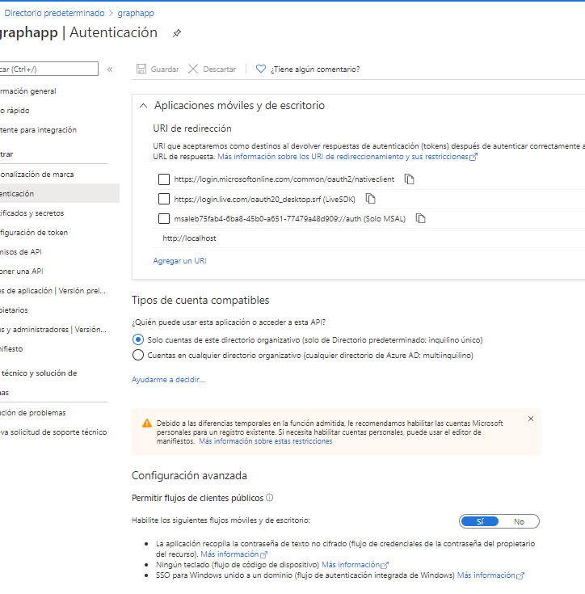
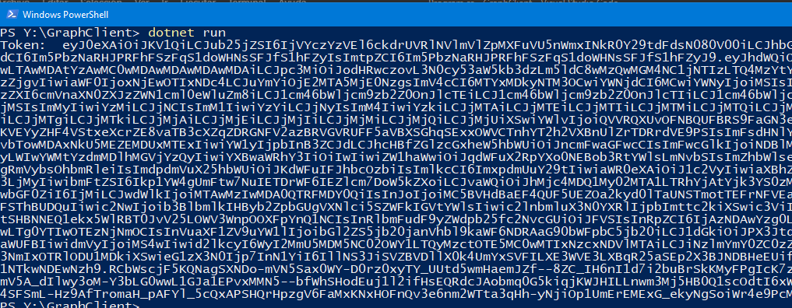
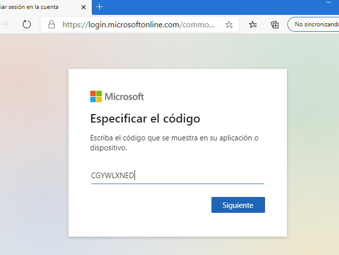
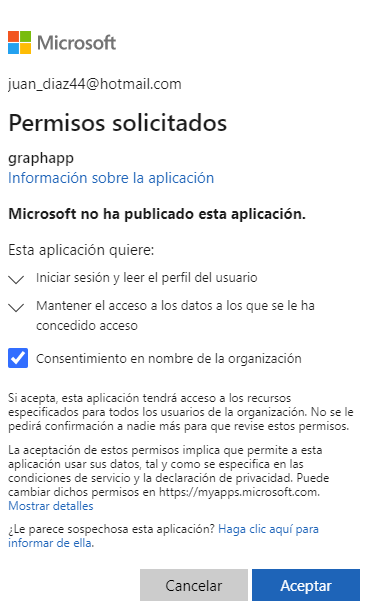
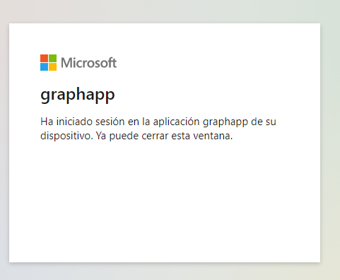

https://microsoftlearning.github.io/AZ-204-DevelopingSolutionsforMicrosoftAzure/Instructions/Labs/AZ-204_06_lab.html

## AZ-204: DEVELOPING SOLUTIONS FOR MICROSOFT AZURE


### Lab: Authenticating to and querying Microsoft Graph by using MSAL and .NET SDKs
 


#### 1.- Registramos una aplicación graphapp




Nos copiamos el idAplicacion  
y el idinquilino  




```
  _clientId = "eb75fab4-6ba8-45b0-a651-77479a48d909";
  _tenantId = "03400c84-c523-4836-b6c0..............";
````


y configuramos la Autentificacion




#### Ejercicio 2: obtenga un token mediante la biblioteca MSAL.NET

```c#
dotnet new console --name GraphClient --output .  -f netcoreapp3.1 

dotnet add package Microsoft.Identity.Client --version 4.7.1

dotnet build
```

Modificamos el program.cs para que nos muestre el token

```
using System;
using Microsoft.Identity.Client;
using System.Collections.Generic;
using System.Threading.Tasks;

  _clientId = "eb75fab4-6ba8-45b0-a651-77479a48d909";
  _tenantId = "03400c84-c523-4836-b6c0..............";

namespace GraphClient
{
    public class Program
    {
        private const string _clientId = "eb75fab4-6ba8-45b0-a651-77479a48d909";
        private const string _tenantId = "03400c84-c523-4836-b6c0..............";
            
        public static async Task Main(string[] args)
        {
            var app = PublicClientApplicationBuilder
                .Create(_clientId)
                .WithAuthority(AzureCloudInstance.AzurePublic, _tenantId)
                .WithRedirectUri("http://localhost")
                .Build();
            List<string> scopes = new List<string> 
            { 
                "user.read" 
            };
            var result = await app
                .AcquireTokenInteractive(scopes)
                .ExecuteAsync();
            Console.WriteLine($"Token:\t{result.AccessToken}");
        }
    }
}
```

y ejecutamos. Hasta aqui nada nuevo pues es igual a la demo 02




#### Exercise 3: Query Microsoft Graph by using the .NET SDK


Añadimos Microsoft.Graph.Auth y Microsoft.Graph
```c#
dotnet add package Microsoft.Graph.Auth --version 1.0.0-preview.2
dotnet add package Microsoft.Graph --version 1.21.0
```


al ejecutar la aplicacón nos lanza el mensaje

To sign in, use a web browser to open the page https://microsoft.com/devicelogin and enter the code CGYWLXNED to authenticate








y obtnemos los datos por consola


