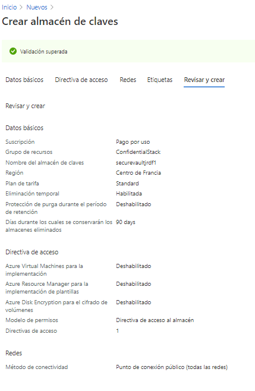

#### Exercise 1: Create Azure resources

1.- Creacción de la cuenta de alamacenamiento  


2.- Copiamos el valor de la cadena de conexión de la cuenta de alamacenamiento


```
CADENACONEXXION:

DefaultEndpointsProtocol=https;AccountName=securestorjrdf;AccountKey=vDrYsOi9moVmrgOsGtlKV6hdrMK2o13NaJxJaXHvinvTl9C3QQOkp5mSUiY6Unjx5cuYXNBFtl6V8exW5gprqw==;EndpointSuffix=core.windows.net
```

3.- Creamos un Key Vault (securevaultjrdf1)



4.- Azure Functions app (securefuncjrdf)


#### Exercise 2: Configure secrets and identities

1.- funcion: Habilitar identidad asignada por el sistema 


2.-  Create a Key Vault secret el valor será la cadenaconexion

3.- copiar el id del secreto

```
valueid=https://securevaultjrdf1.vault.azure.net/secrets/storagecredentials/d2ca946f55864b479bc89369d1b49434
```


4.-  Configure a Key Vault access policy


5.- Tarea 4: Crear una configuración de aplicación derivada de Key Vault


#### Exercise 3: Build an Azure Functions app


----
 
1.- Creamos la app funcion en local  

```
func init --worker-runtime dotnet
```

2.- Creamos la funcion FileParser

```
func new --template "HTTP trigger" --name "FileParser"
```

3.- Modificamos local.settings.json con StorageConnectionString de test
```
{
    "IsEncrypted": false,
    "Values": {
        "AzureWebJobsStorage": "UseDevelopmentStorage=true",
        "FUNCTIONS_WORKER_RUNTIME": "dotnet",
        "StorageConnectionString": "[TEST VALUE]"
    }
}
```
4.- Modificamos FileParser.cs
```
 using Microsoft.AspNetCore.Mvc;
 using Microsoft.Azure.WebJobs;
 using Microsoft.AspNetCore.Http;
 using System;
 using System.Threading.Tasks;

 public static class FileParser
 {
     [FunctionName("FileParser")]
     public static async Task<IActionResult> Run(
         [HttpTrigger("GET")] HttpRequest request)
     {
         string connectionString = Environment.GetEnvironmentVariable("StorageConnectionString");
         return new OkObjectResult(connectionString);
     }
 }
 ``` 
 5.- Probamos con  httprepl (https://www.nuget.org/packages/Microsoft.dotnet-httprepl)  
 
 ```
 httprepl http://localhost:7071
 ```
 
 
 
 
 6.- la subimos a Azure
 
 
 ```
 az login
 
 func azure functionapp publish securefuncjrdf
 
 ```
 
 
 7.- la probamos GET
 
  
 
 
 Vemos que funciona!!
 
  
 
 #### Exercise 4: Access Azure Blob Storage data
 
 
 
 1.- creaccion del contenedor nombre drop nivel de acceso  Blob (anonymous read access for blobs only) y subimos el archivo record.json

Comprobamos que con ese nivel de acceso podemos llerlo

 
  
  
 Le cambiamos a  Private (no anonymous access) y vemos que ya no podemos leerlo
 
   
 
 
 
 2.- Vamos a cambiar la impementación de la funcion para que nos la lea
 
 
 ```
 dotnet add package Azure.Storage.Blobs --version 12.6.0
 ```
 
 
 Modificamos el FileParser
 ```
  using Azure.Storage.Blobs;
 using Microsoft.AspNetCore.Mvc;
 using Microsoft.Azure.WebJobs;
 using Microsoft.AspNetCore.Http;
 using System;
 using System.Threading.Tasks;

 public static class FileParser
 {
     [FunctionName("FileParser")]
     public static async Task<IActionResult> Run(
         [HttpTrigger("GET")] HttpRequest request)
     {
         string connectionString = Environment.GetEnvironmentVariable("StorageConnectionString");
         BlobClient blob = new BlobClient(connectionString, "drop", "records.json");
         var response = await blob.DownloadAsync();
         return new FileStreamResult(response?.Value?.Content, response?.Value?.ContentType);
     }
 }
 
 ```` 
 
 y publicamos
 
  ```
 func azure functionapp publish securefuncjrdf
  ```
 
 Volvemos a ejecutar las pruebas y nos devuelve el json
 
 
 
 
 ----